# Tugas Praktikum 1 (Pertemuan ke 6) 

|**Nama**|**NIM**|**Kelas**|**Mata Kuliah**|
|----|---|-----|------|
|**Radityatama Nugraha**|**312310644**|**TI.23.A6**|**Basis Data**|

## 1. Buat database dengan nama latihan0000001!

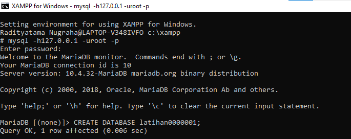

## 2. Buat sebuah table dengan nama biodata (nama,alamat) di dalam database latihan0000001!

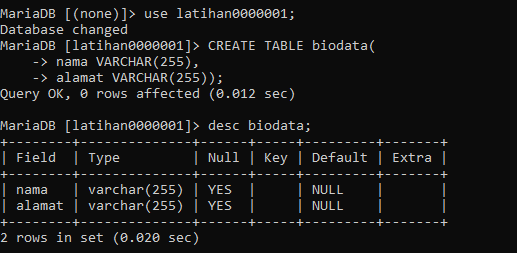

## 3.	Tambahkan sebuah kolom keterangan (varchar15), sebagai kolom terakhir!

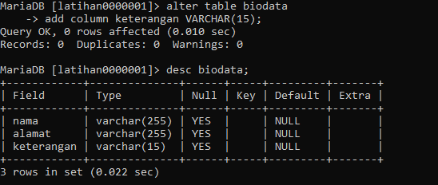

## 4.	Tambahkan kolom id (int11) di awal (sebagai kolom pertama)!

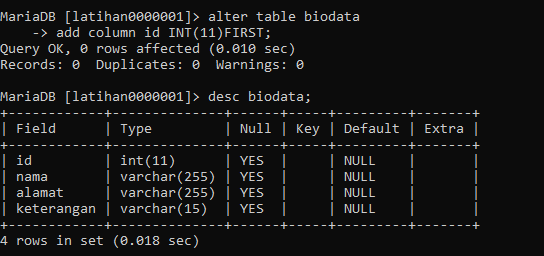

## 5.	Sisipkan sebuah kolom dengan nama phone (varchar15) setelah kolom Alamat!

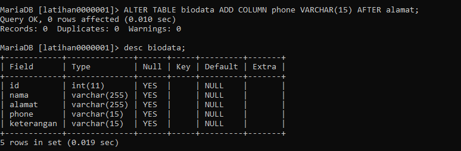

## 6.	Ubah tipe data kolom id menjadi char(11)!

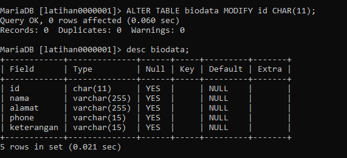

## 7.	Ubah nama kolom phone menjadi hp (varchar20)!

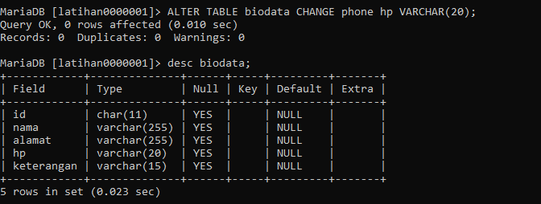

## 8.	Tambahkan kolom email setelah kolom hp!

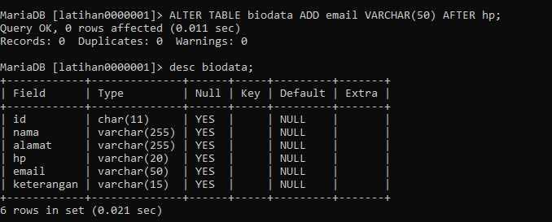

## 9.	Hapus kolom keterangan dari table!

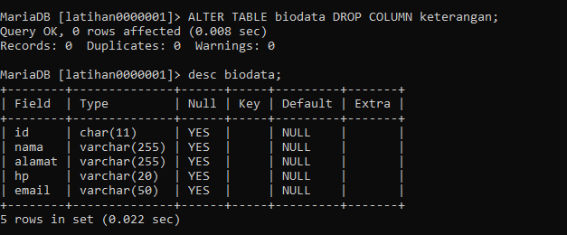

## 10. Ganti nama table menjadi data_mahasiswa!

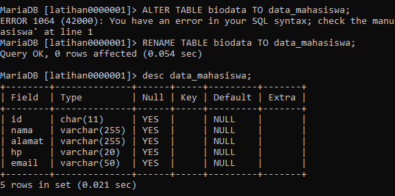

## 11. Ganti nama field menjadi nim!

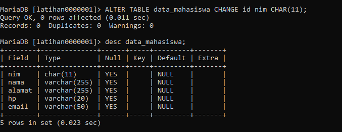

## 12. Jadikan nim sebagai primary key!

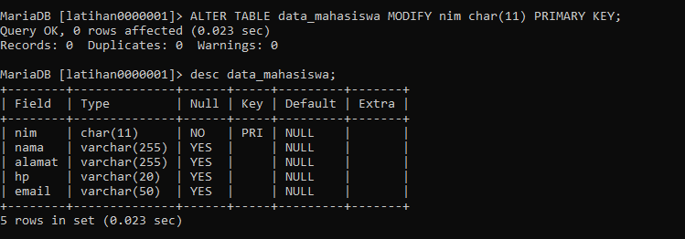

## 13. Jadikan kolom email sebagai unique key!

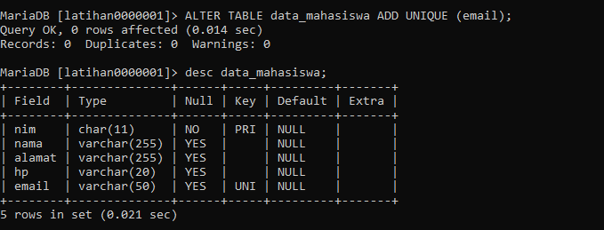
